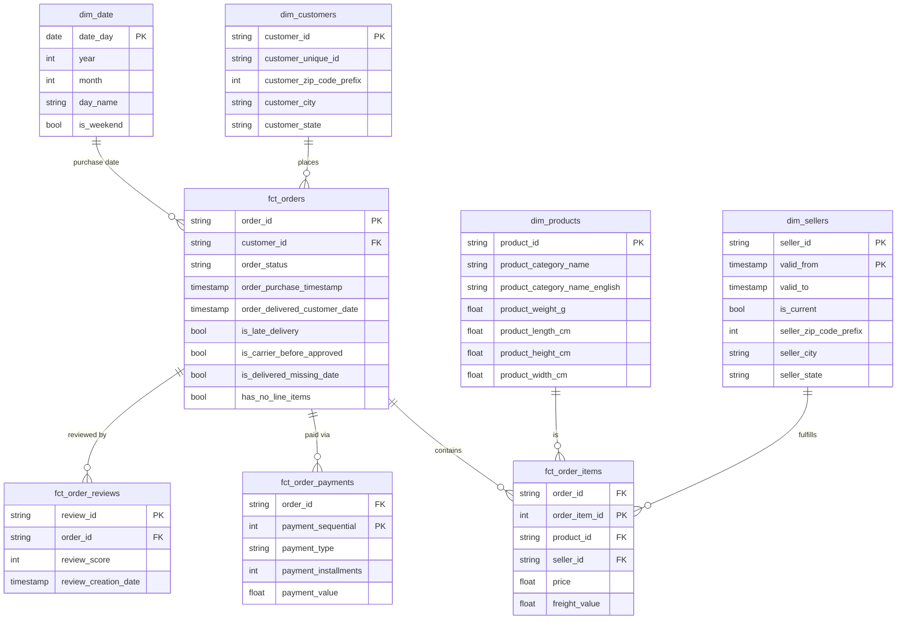

# Olist Marketplace Data Pipeline

A data pipeline for Olist's Brazilian e-commerce marketplace dataset, built for a
**BI/analytics dashboard** -- not a predictive-ML project. Raw historical order
data is cleaned and constraint-validated in PostgreSQL, federated into
BigQuery, and reshaped into a star schema with dbt for downstream dashboarding.

## Business case

The dashboard is meant to give stakeholders visibility into three things the
raw data already shows real signal on:

- **Delivery performance** -- 8.1% of delivered orders arrive after their
  estimated date; 1,359 orders have carrier/approval timestamp inversions
  worth investigating.
- **Customer satisfaction** -- review scores skew positive overall, but ~14.6%
  are 1-2 star and worth segmenting by seller, category, and delivery delay.
- **Marketplace/seller health** -- order volume, revenue, and cancellation
  patterns across sellers and product categories.

The pipeline is built around **constraint-first integrity** (Postgres enforces
what's provably clean) plus **transparent flagging** (real anomalies are
surfaced as queryable data, never silently dropped or hidden).

## Architecture

```
CSVs (data/)
  -> PostgreSQL / Cloud SQL staging schema  (constraints enforced, CP-consistent)
    -> BigQuery `raw` dataset               (federated EXTERNAL_QUERY materialization)
      -> dbt staging models                 (typed/cleaned, 1:1 with source)
        -> dbt star schema marts            (dim_*, fct_*)
          -> BI dashboard tool (not yet connected)
```

**Why Postgres for staging, not straight to BigQuery?** Chosen deliberately
via a CAP-theorem lens: this is a batch-loaded, non-real-time source, so
sacrificing Availability for Consistency + Partition tolerance was the right
trade -- a CP relational database lets constraint violations get caught at
write time (PK/FK/CHECK), rather than discovered after the fact.

**Why federated `EXTERNAL_QUERY` instead of a Python mover script or
GCS-staged load?** No intermediate copy step, no separate compute to run and
pay for -- BigQuery reads Cloud SQL directly through a secure, IAM-authenticated
connection. Traded off against a Python-script mover (more control, more
moving parts) and GCS-staged loading (heavier, more GCP-native for larger
scale); federation was the leanest fit for this data's size and cadence.

## Status

| Stage | Status |
|---|---|
| Data integrity check (9 raw CSVs) | Done -- solid referential integrity overall; found duplicate geolocation rows, timestamp anomalies, late deliveries, orphan categories (see `src/data_integrity_check.py`) |
| Postgres staging schema (Cloud SQL) | Done -- constraints enforced only where zero violations were verified; anomalies deliberately left unblocked |
| Cloud SQL instance + connectivity | Done -- Public IP + Cloud SQL Python Connector (IAM-auth, no IP allowlisting) |
| BigQuery <-> Cloud SQL federated connection | Done |
| Raw data materialized into BigQuery | Done -- 9 tables in `raw` dataset via `EXTERNAL_QUERY` |
| dbt star schema (staging + marts) | Done -- all models and tests passing |
| Anomaly monitoring | Done -- warn-severity dbt tests on `fct_orders` flag columns |
| SCD Type 2 (seller location) | Done -- `dbt snapshot` on sellers |
| Automation/scheduling | **Not started** -- all steps currently run manually |
| Dashboard/BI tool connection | **Not started** |

## Project structure

```
.
├── data/                    Raw Olist CSVs + integrity-check output
├── src/                     Standalone pipeline scripts
│   ├── data_integrity_check.py
│   ├── staging_schema.sql
│   ├── apply_schema.py
│   └── load_to_cloudsql.py
├── dbt_olist/                dbt project (staging models, star schema marts, snapshot)
│   ├── models/staging/
│   ├── models/marts/
│   ├── snapshots/
│   └── macros/
├── notebooks/                Exploratory notebook(s)
├── .env.example               Template for Cloud SQL connection details
└── .gitignore
```

## How to run

### Prerequisites

- Python with `pandas`, `sqlalchemy`, `cloud-sql-python-connector[pg8000]`,
  `python-dotenv` installed
- `dbt-core` + `dbt-bigquery` installed
- `gcloud` CLI installed and authenticated (`gcloud auth application-default login`)
- A Cloud SQL for PostgreSQL instance and a BigQuery project already created

### 1. Configure credentials

```
cp .env.example .env
```
Fill in `INSTANCE_CONNECTION_NAME`, `DB_USER`, `DB_PASS`, `DB_NAME`.

### 2. Load raw CSVs into Postgres (Cloud SQL)

```
cd src
python apply_schema.py       # creates the staging schema + all 9 tables/constraints
python load_to_cloudsql.py   # loads all 9 CSVs, FK-safe order
```

### 3. Federate Cloud SQL into BigQuery

One-time setup (see full command reference in project history / ask if you
need the exact `bq mk --connection` / IAM-grant commands re-shared):

```
gcloud services enable bigqueryconnection.googleapis.com
bq mk --connection --connection_type=CLOUD_SQL ...
bq mk --dataset --location=<region> <project>:raw
```

Then, on every refresh:

```powershell
$conn = "<project>.<region>.<connection_name>"
$tables = @("customers","sellers","category_translation","products","geolocation_raw","orders","order_items","order_payments","order_reviews")
foreach ($t in $tables) {
    bq query --use_legacy_sql=false --location=<region> "CREATE OR REPLACE TABLE raw.$t AS SELECT * FROM EXTERNAL_QUERY('$conn', 'SELECT * FROM staging.$t')"
}
```

### 4. Run the dbt transformation

```
cd dbt_olist
dbt deps
dbt build
```

This runs staging views, the star schema marts, the seller snapshot, and all
tests together. Produces `staging.*` (typed/cleaned views), `star_schema_olist.*`
(the star schema), and `snapshots.sellers_snapshot`.

## dbt design notes

### Why constraints are split between Postgres and dbt tests

Postgres enforces structural rules with **zero known violations** at write
time (PK/FK uniqueness, `price > 0`, `review_score` 1-5, etc.) -- real
rejection, not just reporting. dbt tests re-assert the same rules at the
BigQuery layer (catches transfer/load bugs Postgres can't see) and additionally
carry the **anomaly monitors**: `is_late_delivery`, `is_carrier_before_approved`,
`is_delivered_missing_date`, `has_no_line_items` are computed once as columns
on `fct_orders`, then watched by `warn`-severity tests thresholded ~15-20%
above their known baseline rate -- normal operation stays green, only a
genuine spike surfaces a warning. These are never hard-enforced as CHECK
constraints because they're real, expected data, not corruption; rejecting
them would silently drop legitimate orders.

### Why SCD Type 2 (`dbt snapshot`) only for sellers

A live pipeline (as opposed to this project's historical batch load) means
dimension attributes can genuinely change after facts referencing them
already exist. The decision to snapshot uses one test: **does a fact table
need the dimension's value as of the time the fact occurred, not just its
current value?**

Every dimension in the star schema was reviewed against that test:

| Dimension | Verdict | Reasoning |
|---|---|---|
| **`dim_sellers` (location)** | **Type 2 -- implemented** | Regional delivery/performance analysis needs a seller's location *at the time of each order*. If a seller relocates, historical shipping-performance numbers must not be silently rewritten to reflect their new location. This is the one case where the "genuine change + historical facts need point-in-time accuracy" test clearly holds. |
| `dim_customers` (address) | Reviewed, not implemented | Symmetric reasoning to sellers -- *but* Olist's `customer_id` is already one row per order (not per person; `customer_unique_id` is the repeat-customer key), so the source data already captures "address at time of order" structurally. Only becomes a real gap if a live system redesigns customers into one-row-per-person with in-place updates -- worth re-checking against the actual live source design before adding. |
| `dim_products` (category) | Reviewed, not implemented | Depends on *why* a category changes. A correction of bad data should propagate everywhere (Type 1); only a genuine reclassification needing point-in-time-accurate historical reporting would warrant Type 2. Left undecided pending that business clarification. |
| `dim_products` (weight/dimensions) | Reviewed, not implemented | Freight-cost analysis is tied to weight at time of shipment, so this looked like a candidate at first glance -- but a product's physical weight doesn't genuinely change; an updated value is almost always a data correction (originally mismeasured), which argues for Type 1, not Type 2. |
| `dim_geolocation` (zip mapping) | Reviewed, not implemented | Postal boundary reassignment happens in reality but is rare and low business value here -- not worth the complexity. |
| `category_translation` | Reviewed, not implemented | A translation fix is a correction, not a business event. |
| Order status lifecycle | Reviewed, not implemented (yet) | Currently captured via dedicated timestamp columns on `orders` (purchase/approved/carrier/delivered), which is a cleaner fit than SCD for this specific shape of history. Worth revisiting if a live system adds status types (canceled/returned/refunded) with no dedicated timestamp column and only mutates a generic `order_status` field -- at that point, snapshotting `order_status` becomes the practical fallback. |

So: one clear "yes" (sellers), several "reviewed and reasoned no" (not simply
skipped), and two genuinely conditional cases (customers, products) deferred
pending source-system design decisions rather than guessed at.

### `sellers_snapshot` implementation

- **Strategy**: `check` (compares `seller_zip_code_prefix`, `seller_city`,
  `seller_state`) -- there's no `updated_at` column in the source to use a
  `timestamp` strategy instead.
- **Sources from `raw.sellers` directly**, not `stg_sellers` -- dbt best
  practice, so snapshot history survives even if staging transformation logic
  changes later.
- `dim_sellers` is now genuinely Type 2: one row per `(seller_id, valid_from)`,
  exposing `valid_from` / `valid_to` / `is_current`. A fact-to-dimension join
  needing point-in-time accuracy should join on `seller_id` **and**
  `shipping_limit_date BETWEEN valid_from AND COALESCE(valid_to, '9999-12-31')`,
  not a plain equi-join on `seller_id` alone.
- History only starts accumulating from the point the snapshot first ran --
  the initial run just establishes a baseline (every seller gets one row).
  The payoff shows up once a seller's location actually changes in a
  subsequent run against a live, changing source.

## Star schema



`dim_sellers` is the one Type 2 dimension (composite key `seller_id` +
`valid_from`); every other dimension is Type 1. `fct_order_items`,
`fct_order_payments`, and `fct_order_reviews` are kept as separate fact
tables at their own natural grain rather than folded into `fct_orders`,
since an order can have multiple items, payments, and reviews -- joining
them into one row would fan out and inflate order-level metrics.

## Known open items

- Automation/scheduling for the BigQuery materialization + `dbt build` steps
  (candidates: Cloud Scheduler + Cloud Run Job, or a scheduled GitHub Actions
  workflow) -- currently all steps are run manually.
- No BI dashboard tool connected yet.
- `dim_customers` / `dim_products` SCD Type 2 decisions remain open pending
  clarification of the live source system's design (see table above).

## Current Pipeline decisions


