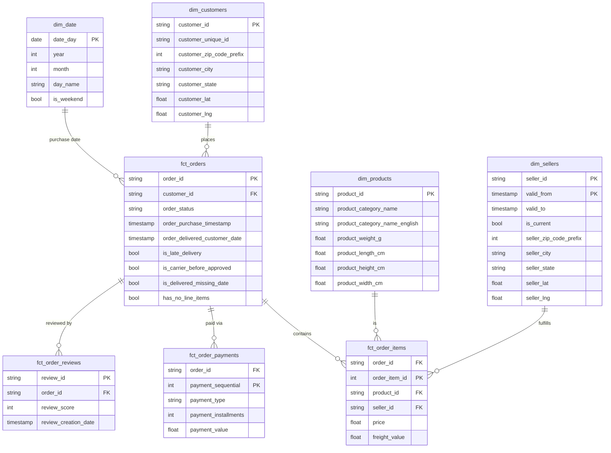

# Olist Marketplace Data Pipeline

A data pipeline for Olist's Brazilian e-commerce marketplace dataset, built for a
**BI/analytics dashboard** -- not a predictive-ML project. The Kaggle source
dataset is pulled into Cloud Storage on a schedule, merged into BigQuery, and
reshaped into a star schema with dbt for downstream dashboarding. (An earlier
Postgres/Cloud SQL staging path is parked, not deleted -- see
[Parked: Postgres staging](#parked-postgres-staging) below.)

## Business case

The dashboard is meant to give stakeholders visibility into three things the
raw data already shows real signal on:

- **Delivery performance** -- 8.1% of delivered orders arrive after their
  estimated date; 1,359 orders have carrier/approval timestamp inversions
  worth investigating.
- **Customer satisfaction** -- review scores skew positive overall, but ~14.6%
  are 1-2 star and worth segmenting by seller, category, and delivery delay.
- **Marketplace/seller health** -- order volume, revenue, and cancellation
  patterns across sellers and product categories.

The pipeline is built around **constraint-first integrity** (Postgres enforces
what's provably clean) plus **transparent flagging** (real anomalies are
surfaced as queryable data, never silently dropped or hidden).

## Architecture

```
Kaggle (olistbr/brazilian-ecommerce)
  -> pull_kaggle_to_gcs (Cloud Function, Cloud Scheduler cron)
       only re-pulls when Kaggle's last-updated metadata moves
    -> GCS bucket, raw/*.csv
      -> load_gcs_to_bigquery (Cloud Function, GCS object-finalize trigger)
           per-file CSV load -> staging table -> MERGE into `raw.<table>`
        -> BigQuery `raw` dataset   (upsert: insert new, update matched, never truncate)
          -> dbt staging models     (typed/cleaned, 1:1 with source -- unchanged)
            -> dbt star schema marts    (dim_*, fct_*, incl. anomaly monitors -- unchanged)
              -> Streamlit dashboard (Cloud Run service, reads star_schema_olist directly -- currently spun down, see Status)

GitHub `main`, merge touching dbt_olist/**
  -> Cloud Build trigger (path-filtered)
    -> dbt-build-job (Cloud Run Job) -> `dbt build` -> staging models + star schema marts
```

The two diagrams above meet at `staging`/`star_schema_olist` but trigger on
different things: the top one reacts to new *data*, the bottom one reacts to
new *code*. Neither currently reacts to the other -- see "Known open items."

Code for both Cloud Functions lives in `cloud_functions/`.

**Why a MERGE upsert instead of `WRITE_TRUNCATE`?** Kaggle re-publishes this
dataset as a full snapshot, not a delta, so a naive reload has to choose
between wiping the table every run (`WRITE_TRUNCATE` -- cheap, but a mid-load
failure leaves `raw` empty until the next successful run, and any downstream
query mid-load sees a partial table) or upserting by key (costs one `MERGE`
per file, but `raw` is never briefly empty and a row Kaggle re-publishes with
a corrected value gets updated in place instead of silently duplicated).
`load_gcs_to_bigquery` loads each file into a throwaway per-table staging
table, then `MERGE`s it into `raw.<table>` on that table's natural key --
`order_id`, `product_id`, `(order_id, order_item_id)`, etc. `geolocation_raw`
has no natural key (~26% legitimate full-row duplicates by design, same as
the parked Postgres schema), so it matches on the full row and inserts only
what isn't already there.

**Why two Cloud Functions instead of one combined pull-and-load function?**
Splitting the Kaggle pull from the BigQuery load lets the load step trigger
directly off each file landing in GCS (a Cloud Storage finalize event) rather
than on a second, independently-scheduled cron -- one less clock to keep in
sync, and a file that lands outside the normal schedule (a manual re-upload,
a retry) still gets picked up automatically.

**Why `kaggle.api.dataset_list()` + `dataset_download_files()` instead of
`kagglehub`?** Two earlier attempts here crashed in production before
settling on this: `kaggle.api.dataset_view()` doesn't exist on the
installed `kaggle` package's `KaggleApi` class, and a follow-up guess
(`dataset_list(search=..., user="olistbr")`) returned zero results because
the added `user` filter over-constrains Kaggle's search. The working
implementation is modeled directly on
`mod2_dbt_project/cloud_funtions/mod2_dataset_robot/main.py`'s proven
pattern instead of guessing again: `dataset_list(search="brazilian-ecommerce")`
with no `user` filter, matched explicitly by `ref`; and downloading via
`kaggle.api.dataset_download_files(..., path="/tmp/...", unzip=True)`
rather than `kagglehub`, whose default cache location isn't guaranteed
writable in a Cloud Functions container -- only `/tmp` reliably is.
One more drift surfaced even after matching the reference: the reference
reads `dataset.lastUpdated` (camelCase), but the `kaggle` package version
that actually installs here (`kaggle==1.*`, unpinned to an exact version)
renamed that attribute to `last_updated` (snake_case) -- confirmed
directly by Python's own "did you mean" suggestion in the traceback, not
guessed. `_kaggle_last_updated()` tries both names so a future package
upgrade in either direction doesn't silently break this again.

**Why does `load_gcs_to_bigquery` create the raw table before merging into
it?** `MERGE` requires its target table to already exist -- BigQuery won't
create one on the fly the way a plain load job will. That gap stayed
invisible through all of testing because `raw.*` already existed (first
from the old Postgres federation), until the whole `raw` dataset got
deleted and every `MERGE` started failing with `NotFound: Table raw.<table>
was not found`. `bq.create_table(..., exists_ok=True)` now runs before
every merge -- idempotent, a no-op once the table exists, but closes the
cold-start gap for a genuinely empty `raw` dataset.

**Two per-table load quirks, caught by an actual `dbt build` run, not
guessed:** `order_reviews` failed with `CSV table references column
position 6, but line contains only N columns` -- `review_comment_message`
is free-text review content that routinely contains literal newlines
inside quoted CSV fields, which BigQuery's parser splits into bogus rows
without `allow_quoted_newlines=True` (now set on every load, harmless for
tables without this issue). Separately, `geolocation_raw` failed with
invalid-value errors on `geolocation_lat` -- BigQuery's `NUMERIC` defaults
to a 9-digit decimal scale, unlike Postgres's arbitrary-precision
`NUMERIC`, and real values here have up to ~14 decimal digits. Fixed by
typing lat/lng as `FLOAT64` instead, which also matches how the star
schema already types `customer_lat`/`seller_lat`.

## Status

| Stage | Status |
|---|---|
| Data integrity check (9 raw CSVs) | Done -- solid referential integrity overall; found duplicate geolocation rows, timestamp anomalies, late deliveries, orphan categories (see `src/data_integrity_check.py`) |
| Postgres staging schema (Cloud SQL) | **Parked** -- superseded by the GCS/BigQuery pipeline below; scripts kept in `src/` for reference, see [Parked: Postgres staging](#parked-postgres-staging) |
| BigQuery <-> Cloud SQL federated connection | **Parked** -- replaced by the two Cloud Functions below |
| `pull_kaggle_to_gcs` (Kaggle -> GCS) | Code written -- not yet deployed |
| `load_gcs_to_bigquery` (GCS -> BigQuery, MERGE upsert) | Code written -- not yet deployed |
| Raw data materialized into BigQuery | **Not started** -- pending deploy of the two functions above |
| dbt star schema (staging + marts) | Done -- all models and tests passing; unaffected by the ingestion swap (same `raw.*` table names/columns) |
| Anomaly monitoring | Done -- unchanged, warn-severity dbt tests on `fct_orders` flag columns |
| SCD Type 2 (seller location) | Done -- unchanged, `dbt snapshot` on sellers |
| Automation/scheduling | **In progress** -- `raw.*` refreshes nightly (Cloud Scheduler + GCS-triggered load); `dbt build` now runs via Cloud Build + a Cloud Run Job on merges to `main` that touch `dbt_olist/**`, but only on code changes -- a code-free night (data only) still needs `dbt build` run by hand; GitHub connection step is manual, not yet completed |
| Dashboard/BI tool connection | Built + deployed once successfully, then **intentionally spun down** (`gcloud run services delete`) to close the public `--allow-unauthenticated` URL while idle -- redeploy with the step 9 command any time, nothing lost |

## Project structure

```
.
├── data/                    Raw Olist CSVs + integrity-check output
├── cloud_functions/          Active ingestion pipeline (Kaggle -> GCS -> BigQuery)
│   ├── pull_kaggle_to_gcs/     Cloud Scheduler-triggered pull, skips unchanged data
│   └── load_gcs_to_bigquery/   GCS-triggered load + MERGE upsert into `raw`
├── src/                     Parked Postgres pipeline scripts (see below)
│   ├── data_integrity_check.py
│   ├── staging_schema.sql
│   ├── apply_schema.py
│   └── load_to_cloudsql.py
├── dbt_olist/                dbt project (staging models, star schema marts, snapshot)
│   ├── models/staging/
│   ├── models/marts/
│   ├── snapshots/
│   ├── macros/
│   ├── Dockerfile               dbt-build-job image (Cloud Run Job)
│   ├── .dockerignore
│   └── profiles.yml.ci          Baked-in, secret-free profile (method: oauth)
├── cloudbuild.yaml            Cloud Build config for dbt-build-job (repo root)
├── dashboard/                 Streamlit dashboard (Cloud Run service)
│   ├── app.py
│   ├── requirements.txt
│   ├── Dockerfile
│   └── .streamlit/config.toml
├── notebooks/                Exploratory notebook(s)
├── .env.example               Template for the parked Postgres path's connection details
└── .gitignore
```

## IAM reference: every service account and why

Every role below was actually required to get this pipeline running end-to-end
on `project-858e450f-408c-4bd2-941` -- most were only discovered when a
specific step failed partway through deployment (see the "discovered by"
column), not planned upfront. This section exists so a genuinely from-scratch
setup on a new account/project hits none of those errors, by granting
everything in the right order the first time. `<PROJECT_NUMBER>` below is
`588691405952` for this project; substitute your own (`gcloud projects
describe <PROJECT_ID> --format="value(projectNumber)"`) on a different one.

Five identities are involved. Two of them you never create yourself --
they're Google-managed and provisioned lazily on first use, which is itself
a common trap (see below).

### 1. Your own user account

If you create a brand-new GCP project yourself, you're automatically
`roles/owner` on it -- that one role covers every command in this guide, and
is the simplest path for a genuinely new account. If you're working inside a
project you don't own outright (shared, org-managed), the granular bundle
this guide's commands actually need instead:

| Role | Why |
|---|---|
| `roles/serviceusage.serviceUsageAdmin` | Enable the 8 APIs in step 1 |
| `roles/resourcemanager.projectIamAdmin` | Grant project-level roles to service accounts |
| `roles/iam.serviceAccountAdmin` | Create the `scheduler-invoker` service account |
| `roles/storage.admin` | Create the bucket, set its IAM |
| `roles/bigquery.admin` | Create datasets/tables |
| `roles/secretmanager.admin` | Create the Kaggle credential secrets |
| `roles/cloudfunctions.developer` + `roles/run.developer` | Deploy Cloud Functions Gen2 (Cloud Run underneath) and the dashboard |
| `roles/cloudscheduler.admin` | Create the nightly pull schedule |
| `roles/eventarc.admin` | Cloud Functions deploy creates the Eventarc trigger on your behalf, but needs this to succeed |

### 2. Default compute service account

`<PROJECT_NUMBER>-compute@developer.gserviceaccount.com` -- auto-created by
Google the first time the Compute Engine API is enabled on a project
(effectively every project has one; you never run `iam service-accounts
create` for it). **All four** of this pipeline's compute resources --
`pull-kaggle-to-gcs`, `load-gcs-to-bigquery`, the Eventarc trigger that
invokes it, and the dashboard's Cloud Run service -- default to running as
this one identity, because none of this guide's deploy commands pass
`--service-account` / `--trigger-service-account` to override it (see
"Worth reviewing" at the end of this section).

| Role | Scope | Why | Discovered by |
|---|---|---|---|
| `roles/secretmanager.secretAccessor` | secret `kaggle-username` | `pull-kaggle-to-gcs` reads it as `KAGGLE_USERNAME` | Designed in |
| `roles/secretmanager.secretAccessor` | secret `kaggle-key` | reads it as `KAGGLE_KEY` | Designed in |
| `roles/bigquery.dataEditor` | project | `load-gcs-to-bigquery` creates + writes `raw`/`raw_stage` tables; dashboard reads `star_schema_olist` | Designed in |
| `roles/bigquery.jobUser` | project | required to *run* any BigQuery job (load, query, `MERGE`) as this identity -- a separate permission from `dataEditor` | Designed in |
| `roles/storage.objectAdmin` | bucket `<bucket-name>` | `pull-kaggle-to-gcs` writes CSVs; `load-gcs-to-bigquery` reads them | Designed in |
| `roles/cloudbuild.builds.builder` | project | Cloud Functions Gen2 builds a container via Cloud Build under the hood; first deploy failed with "missing permission on the build service account" without this | First `pull-kaggle-to-gcs` deploy |
| `roles/eventarc.eventReceiver` | project | lets this SA, as the Eventarc trigger's identity, receive the GCS finalize event | `403 eventarc.events.receiveEvent` on the first fired trigger |
| `roles/run.invoker` | Cloud Run service `load-gcs-to-bigquery` | lets this SA actually *call* the function after receiving the event -- distinct from `eventReceiver`, both are required | "IAM principal lacks {run.routes.invoke}" warning in logs, persisting even after `eventReceiver` was granted |

The last grant is scoped to one specific Cloud Run service, so it can only be
made *after* `load-gcs-to-bigquery` is deployed once (the service has to
exist to scope a binding to it) -- see the note on ordering below.

### 3. `scheduler-invoker` (dedicated service account you create)

Created explicitly (`gcloud iam service-accounts create scheduler-invoker`)
rather than reusing the default compute SA, so Cloud Scheduler's ability to
invoke a function is scoped to exactly the one function it needs
(`pull-kaggle-to-gcs`), not everything the default compute SA can touch.

| Role | Scope | Why |
|---|---|---|
| `roles/run.invoker` | Cloud Run service `pull-kaggle-to-gcs` | Granted via `gcloud functions add-invoker-policy-binding`, the function-aware wrapper (not a raw `add-iam-policy-binding`) -- lets Cloud Scheduler's OIDC-authenticated call actually invoke the function |

### 4. GCS's own Pub/Sub service agent (Google-managed)

`service-<PROJECT_NUMBER>@gs-project-accounts.iam.gserviceaccount.com`. Never
created with `iam service-accounts create` -- Google provisions it lazily
the first time a project actually uses a GCS -> Pub/Sub notification, which
for this pipeline means the Eventarc storage trigger's setup. **Granting a
role before it exists fails outright** ("Service account ... does not
exist"), which is exactly what happened on the first attempt here.

```powershell
# Force-provision it before granting anything:
gcloud storage service-agent --project=<PROJECT_ID>
```

| Role | Scope | Why |
|---|---|---|
| `roles/pubsub.publisher` | project | Lets GCS publish object-finalize events into Pub/Sub, which Eventarc's storage trigger consumes |

### 5. Eventarc's own service agent (Google-managed)

`service-<PROJECT_NUMBER>@gcp-sa-eventarc.iam.gserviceaccount.com`. Same
lazy-provisioning trap as #4 -- discovered via "Permission denied while
using the Eventarc Service Agent" on the first `load-gcs-to-bigquery`
deploy. One command both provisions it and grants its role:

```powershell
gcloud beta services identity create --service=eventarc.googleapis.com --project=<PROJECT_ID>
```

This grants the built-in `roles/eventarc.serviceAgent` role automatically --
no separate `add-iam-policy-binding` needed.

### 6. `dbt-build-trigger` (dedicated service account you create)

The GitHub-merge Cloud Build trigger runs as this identity, explicitly
assigned via `--service-account` at trigger-creation time -- **not** Cloud
Build's default `<PROJECT_NUMBER>@cloudbuild.gserviceaccount.com`. Two
reasons, one of them not optional:

- Google stopped auto-granting the default Cloud Build service account
  broad project permissions on projects created after mid-2024. This
  project was created during this build, so it almost certainly falls
  under that newer, more restrictive default -- meaning the default SA
  likely *can't* push images or manage Cloud Run Jobs here without a pile
  of the same manual grants a dedicated SA needs anyway, and Google's own
  guidance is to stop relying on it rather than patch it back to broad.
- It matches `mod2_dbt_project`'s own pattern -- every one of *their* five
  Cloud Build triggers runs as a dedicated `dbt-runner@...` identity, never
  the Cloud Build default SA.

A **custom** trigger service account needs every permission spelled out --
unlike the default SA, it inherits nothing implicitly, including logging:

```powershell
gcloud iam service-accounts create dbt-build-trigger --project=project-858e450f-408c-4bd2-941 --display-name="Cloud Build trigger for dbt-build-job"
```

| Role | Scope | Why |
|---|---|---|
| `roles/logging.logWriter` | project | Required for *any* user-specified Cloud Build trigger SA to write build logs -- the default SA has this bundled, a custom one does not |
| `roles/artifactregistry.writer` | project | Push the built image -- `gcr.io` pushes are Artifact-Registry-backed now; a custom SA doesn't inherit this the way the default SA historically did |
| `roles/run.developer` | project | Run `gcloud run jobs update` / `execute` against `dbt-build-job` |
| `roles/iam.serviceAccountUser` | the default compute SA (#2) | Required whenever one identity configures a resource (the job) to run as another identity -- here, the job runs as the compute SA from #2, which already holds `bigquery.dataEditor`/`jobUser` |

None of this has been exercised by a real trigger fire yet (the GitHub
connection step is manual -- see below), so treat it as
documented-but-unverified: if the first real merge-triggered build fails on
a permission error, diagnose it the same way every other gap in this guide
was found, by reading the actual error.

### Correct order for a from-scratch setup

The two lazy-provisioning traps (#4, #5) and the deploy-before-you-can-scope
grant (the `run.invoker` binding in #2) are exactly the ordering pitfalls
this pipeline's actual deployment hit. Doing all of this in the sequence
below avoids every error this guide's "discovered by" column names:

1. Enable APIs (How to run, step 1)
2. Force-provision the two Google-managed service agents (#4, #5 above) and
   grant their roles
3. Grant the default compute SA every role in #2 *except* the final
   `run.invoker` one (it has nothing to scope to yet)
4. Create the bucket + `raw_stage` dataset, store Kaggle secrets
5. Deploy `pull-kaggle-to-gcs`; create `scheduler-invoker` and grant it (#3);
   create the Scheduler job
6. Deploy `load-gcs-to-bigquery`
7. **Now** grant the default compute SA's `run.invoker` binding scoped to
   `load-gcs-to-bigquery` (the last row of #2) -- the service exists now
8. `dbt build` manually once; deploy the dashboard
9. Create `dbt-build-trigger` and grant it the roles in #6, bootstrap the
   `dbt-build-job` image and Cloud Run Job, then connect GitHub and create
   the trigger (assigned to run as `dbt-build-trigger`)

"How to run" below follows this order.

### Worth reviewing (not changed here -- flagging for you to decide)

Two things would tighten this setup's IAM posture further. Neither is
implemented -- both are real trade-offs against the simplicity of what's
here, worth your explicit call rather than a silent change:

- **One shared identity for everything.** All four compute resources (both
  functions, the Eventarc trigger, the dashboard) run as the same default
  compute SA. A dedicated SA per resource would mean, e.g., a compromised
  dashboard couldn't also write to the ingestion bucket -- at the cost of
  repeating steps 2-3 above once per SA instead of once total.
- **Project-level `bigquery.dataEditor`/`jobUser`.** Both are granted at the
  project level, so this identity can edit *any* dataset, not just
  `raw`/`raw_stage`/`star_schema_olist`. BigQuery supports dataset-scoped
  IAM bindings (`bq add-iam-policy-binding` or a dataset's own ACL) that
  would narrow this to exactly the three datasets this pipeline touches.

## How to run

Values below are this project's actual GCP project (`project-858e450f-408c-4bd2-941`,
project number `588691405952`), region (`asia-southeast1` -- matches the
existing `raw` BigQuery dataset's location), and bucket name
(`project-858e450f-408c-4bd2-941-olist-raw`). Commands are PowerShell.

### Prerequisites

- `gcloud` CLI installed and authenticated (`gcloud auth application-default login`)
- A Kaggle account with an API token: kaggle.com -> Account -> Settings ->
  API -> **Create New Token** -> downloads `kaggle.json` (`{"username": ..., "key": ...}`)
- `dbt-core` + `dbt-bigquery` installed

### 1. Enable required APIs (one-time)

```powershell
gcloud services enable cloudfunctions.googleapis.com cloudscheduler.googleapis.com cloudbuild.googleapis.com eventarc.googleapis.com artifactregistry.googleapis.com run.googleapis.com secretmanager.googleapis.com pubsub.googleapis.com --project=project-858e450f-408c-4bd2-941
```

### 2. Store Kaggle credentials in Secret Manager

Open the downloaded `kaggle.json` and copy the `username`/`key` values in below
(`-NoNewline` matters -- a trailing newline in the key breaks Kaggle auth):

```powershell
Set-Content -Path "$env:TEMP\kaggle-username.txt" -Value "<your-kaggle-username>" -NoNewline
gcloud secrets create kaggle-username --data-file="$env:TEMP\kaggle-username.txt" --project=project-858e450f-408c-4bd2-941

Set-Content -Path "$env:TEMP\kaggle-key.txt" -Value "<your-kaggle-api-key>" -NoNewline
gcloud secrets create kaggle-key --data-file="$env:TEMP\kaggle-key.txt" --project=project-858e450f-408c-4bd2-941

Remove-Item "$env:TEMP\kaggle-username.txt", "$env:TEMP\kaggle-key.txt"
```

### 3. Grant IAM roles (see the IAM reference above for what/why)

Force-provision the two Google-managed service agents first -- granting
their roles before they exist fails outright:

```powershell
gcloud storage service-agent --project=project-858e450f-408c-4bd2-941
gcloud beta services identity create --service=eventarc.googleapis.com --project=project-858e450f-408c-4bd2-941
```

Then grant the default compute service account
(`588691405952-compute@developer.gserviceaccount.com`) everything it needs
*except* the `run.invoker` binding on `load-gcs-to-bigquery` -- that service
doesn't exist yet, so there's nothing to scope it to until step 6:

```powershell
gcloud secrets add-iam-policy-binding kaggle-username --member="serviceAccount:588691405952-compute@developer.gserviceaccount.com" --role="roles/secretmanager.secretAccessor" --project=project-858e450f-408c-4bd2-941
gcloud secrets add-iam-policy-binding kaggle-key --member="serviceAccount:588691405952-compute@developer.gserviceaccount.com" --role="roles/secretmanager.secretAccessor" --project=project-858e450f-408c-4bd2-941
gcloud projects add-iam-policy-binding project-858e450f-408c-4bd2-941 --member="serviceAccount:588691405952-compute@developer.gserviceaccount.com" --role="roles/bigquery.dataEditor"
gcloud projects add-iam-policy-binding project-858e450f-408c-4bd2-941 --member="serviceAccount:588691405952-compute@developer.gserviceaccount.com" --role="roles/bigquery.jobUser"
gcloud projects add-iam-policy-binding project-858e450f-408c-4bd2-941 --member="serviceAccount:588691405952-compute@developer.gserviceaccount.com" --role="roles/cloudbuild.builds.builder"
gcloud projects add-iam-policy-binding project-858e450f-408c-4bd2-941 --member="serviceAccount:588691405952-compute@developer.gserviceaccount.com" --role="roles/eventarc.eventReceiver"
gcloud projects add-iam-policy-binding project-858e450f-408c-4bd2-941 --member="serviceAccount:service-588691405952@gs-project-accounts.iam.gserviceaccount.com" --role="roles/pubsub.publisher"
```

### 4. Create the bucket and staging dataset (one-time)

`raw` already exists (from the parked Postgres path) -- only `raw_stage` is new:

```powershell
gcloud storage buckets create gs://project-858e450f-408c-4bd2-941-olist-raw --project=project-858e450f-408c-4bd2-941 --location=asia-southeast1 --uniform-bucket-level-access
gcloud storage buckets add-iam-policy-binding gs://project-858e450f-408c-4bd2-941-olist-raw --member="serviceAccount:588691405952-compute@developer.gserviceaccount.com" --role="roles/storage.objectAdmin"
bq mk --dataset --location=asia-southeast1 project-858e450f-408c-4bd2-941:raw_stage
```

### 5. Deploy `pull-kaggle-to-gcs` + its schedule

Gen2 function *resource names* follow Cloud Run naming (hyphens, no
underscores) even though the Python entry-point function is still
`pull_kaggle_to_gcs`:

```powershell
gcloud functions deploy pull-kaggle-to-gcs --gen2 --runtime=python312 --region=asia-southeast1 --project=project-858e450f-408c-4bd2-941 --source=cloud_functions/pull_kaggle_to_gcs --entry-point=pull_kaggle_to_gcs --trigger-http --no-allow-unauthenticated --memory=512Mi --timeout=300s --set-env-vars=BUCKET_NAME=project-858e450f-408c-4bd2-941-olist-raw --set-secrets='KAGGLE_USERNAME=kaggle-username:latest,KAGGLE_KEY=kaggle-key:latest'

gcloud iam service-accounts create scheduler-invoker --project=project-858e450f-408c-4bd2-941 --display-name="Cloud Scheduler invoker for pull-kaggle-to-gcs"
gcloud functions add-invoker-policy-binding pull-kaggle-to-gcs --region=asia-southeast1 --project=project-858e450f-408c-4bd2-941 --member="serviceAccount:scheduler-invoker@project-858e450f-408c-4bd2-941.iam.gserviceaccount.com"

$FUNCTION_URL = gcloud functions describe pull-kaggle-to-gcs --region=asia-southeast1 --project=project-858e450f-408c-4bd2-941 --format="value(serviceConfig.uri)"
gcloud scheduler jobs create http pull-kaggle-nightly --project=project-858e450f-408c-4bd2-941 --location=asia-southeast1 --schedule="0 3 * * *" --uri=$FUNCTION_URL --http-method=POST --oidc-service-account-email="scheduler-invoker@project-858e450f-408c-4bd2-941.iam.gserviceaccount.com"
```

### 6. Deploy `load-gcs-to-bigquery` (GCS-triggered)

```powershell
gcloud functions deploy load-gcs-to-bigquery --gen2 --runtime=python312 --region=asia-southeast1 --project=project-858e450f-408c-4bd2-941 --source=cloud_functions/load_gcs_to_bigquery --entry-point=load_gcs_to_bigquery --trigger-event-filters="type=google.cloud.storage.object.v1.finalized" --trigger-event-filters="bucket=project-858e450f-408c-4bd2-941-olist-raw" --trigger-location=asia-southeast1 --set-env-vars='GCP_PROJECT_ID=project-858e450f-408c-4bd2-941,RAW_DATASET=raw,STAGE_DATASET=raw_stage'
```

Now that the service exists, grant the last deferred binding from step 3 --
the Eventarc trigger's identity (the default compute SA) needs this to
actually invoke the function, not just receive the event:

```powershell
gcloud functions add-invoker-policy-binding load-gcs-to-bigquery --region=asia-southeast1 --project=project-858e450f-408c-4bd2-941 --member="serviceAccount:588691405952-compute@developer.gserviceaccount.com"
```

### 7. Verify

```powershell
gcloud functions call pull-kaggle-to-gcs --region=asia-southeast1 --project=project-858e450f-408c-4bd2-941 --gen2
gcloud functions logs read pull-kaggle-to-gcs --region=asia-southeast1 --project=project-858e450f-408c-4bd2-941 --gen2 --limit=50
gcloud functions logs read load-gcs-to-bigquery --region=asia-southeast1 --project=project-858e450f-408c-4bd2-941 --gen2 --limit=50
gcloud storage ls gs://project-858e450f-408c-4bd2-941-olist-raw/raw/
bq query --use_legacy_sql=false --project_id=project-858e450f-408c-4bd2-941 "SELECT COUNT(*) FROM raw.orders"
```

### 8. Run the dbt transformation

```
cd dbt_olist
dbt deps
dbt build
```

This runs staging views, the star schema marts, the seller snapshot, and all
tests together -- identical to before, since it still reads from `raw.*` and
nothing about the dbt project changed. Produces `staging.*` (typed/cleaned
views), `star_schema_olist.*` (the star schema), and `snapshots.sellers_snapshot`.

### 9. Deploy the dashboard

```powershell
gcloud run deploy olist-dashboard --source=dashboard --region=asia-southeast1 --project=project-858e450f-408c-4bd2-941 --platform=managed --allow-unauthenticated
```

`--source=dashboard` builds `dashboard/Dockerfile` via Cloud Build and deploys
it in one step -- the same target (a Cloud Run service, `--platform=managed`,
publicly reachable) as `mod2_dbt_project/cloudbuild.yaml`'s `deploy-streamlit`
step, just without needing a separate multi-trigger pipeline for a single
service. No new IAM grant needed -- it runs as the same default compute
service account already holding `bigquery.dataEditor` + `bigquery.jobUser`
from step 3.

`--allow-unauthenticated` matches `mod2_dbt_project`'s own choice (and the
Olist dataset is public/anonymized), but it does mean anyone with the URL can
query BigQuery through this dashboard, incurring query cost, with no auth
check. Drop the flag and use `gcloud run services add-iam-policy-binding
olist-dashboard --member=<...> --role=roles/run.invoker` instead if that's
not the intended posture.

#### Spin down / restore the dashboard

Cloud Run already scales to zero (no `minScale` was set), so there's no idle
*compute* cost to save by stopping it -- the actual thing worth turning off
is the public URL itself, since `--allow-unauthenticated` means anyone who
has it can trigger billed BigQuery queries with no auth check. Deleting the
service (not just leaving it idle) closes that off completely:

```powershell
gcloud run services delete olist-dashboard --region=asia-southeast1 --project=project-858e450f-408c-4bd2-941 --quiet
```

Nothing is lost -- the service is built entirely from `dashboard/` in this
repo, not from anything stored in Cloud Run itself. Restore it any time with
the exact same command from step 9:

```powershell
gcloud run deploy olist-dashboard --source=dashboard --region=asia-southeast1 --project=project-858e450f-408c-4bd2-941 --platform=managed --allow-unauthenticated
```

The built container image stays in Artifact Registry after deletion (a small,
ongoing storage cost, same category as the `raw_stage` duplication discussed
above) -- harmless to leave, or list/delete it with `gcloud artifacts
docker images list` / `delete` if you'd rather not.

### 10. Automate dbt build (Cloud Build -> Cloud Run Job)

Ingestion (`raw.*`) already refreshes nightly on its own; `dbt build` has
been manual until now (see the "Known open items" bullet this closes).
**Scope:** this triggers a rebuild when dbt *code* changes merge to `main`
-- it does not run on a schedule, and a night where only fresh Kaggle data
lands with no code change still needs a manual `dbt build` (or a separate,
not-yet-built, data-triggered/scheduled job) to reach the marts. Modeled on
`mod2_dbt_project/cloudbuild.yaml`'s build-image -> push -> update Cloud Run
Job -> execute mechanism, scoped to just `dbt_olist/` rather than that
project's shared dbt+notebook+streamlit image and `_PIPELINE_MODE`
branching -- see `dbt_olist/Dockerfile` and `cloudbuild.yaml` (repo root).

**Additional required step: create a dedicated trigger service account.**
Don't rely on Cloud Build's default service account here -- Google stopped
auto-granting it broad project permissions on projects created after
mid-2024 (this one included), and `mod2_dbt_project`'s own reference uses a
dedicated `dbt-runner@...` identity for every trigger anyway. See IAM
reference #6 above for the full reasoning; commands:

```powershell
gcloud iam service-accounts create dbt-build-trigger --project=project-858e450f-408c-4bd2-941 --display-name="Cloud Build trigger for dbt-build-job"

gcloud projects add-iam-policy-binding project-858e450f-408c-4bd2-941 --member="serviceAccount:dbt-build-trigger@project-858e450f-408c-4bd2-941.iam.gserviceaccount.com" --role="roles/logging.logWriter"
gcloud projects add-iam-policy-binding project-858e450f-408c-4bd2-941 --member="serviceAccount:dbt-build-trigger@project-858e450f-408c-4bd2-941.iam.gserviceaccount.com" --role="roles/artifactregistry.writer"
gcloud projects add-iam-policy-binding project-858e450f-408c-4bd2-941 --member="serviceAccount:dbt-build-trigger@project-858e450f-408c-4bd2-941.iam.gserviceaccount.com" --role="roles/run.developer"
gcloud iam service-accounts add-iam-policy-binding 588691405952-compute@developer.gserviceaccount.com --member="serviceAccount:dbt-build-trigger@project-858e450f-408c-4bd2-941.iam.gserviceaccount.com" --role="roles/iam.serviceAccountUser" --project=project-858e450f-408c-4bd2-941
```

Bootstrap the image once, manually, so there's something for `gcloud run
jobs create` to point at (the trigger only ever *updates* an existing job,
same as `mod2_dbt_project`'s):

```powershell
gcloud builds submit --tag=gcr.io/project-858e450f-408c-4bd2-941/dbt-runner:latest dbt_olist --project=project-858e450f-408c-4bd2-941

gcloud run jobs create dbt-build-job --image=gcr.io/project-858e450f-408c-4bd2-941/dbt-runner:latest --region=asia-southeast1 --project=project-858e450f-408c-4bd2-941 --memory=1Gi --cpu=1 --task-timeout=1800s --max-retries=1
```

**Manual, one-time step I can't do for you:** connect this GitHub repo to
Cloud Build. It requires installing/authorizing the Cloud Build GitHub App
against your GitHub account in a browser -- there's no CLI-only path around
that OAuth consent screen. In the GCP Console: Cloud Build -> Triggers ->
Connect Repository -> GitHub -> authorize -> select `NTungka/Module-2-Project`.

Once connected, create the trigger, path-filtered to only fire on changes
that could affect the dbt build, and explicitly assigned to
`dbt-build-trigger` rather than left to default:

```powershell
gcloud builds triggers create github --name=dbt-build-on-merge --repo-name=Module-2-Project --repo-owner=NTungka --branch-pattern="^main$" --included-files="dbt_olist/**" --build-config=cloudbuild.yaml --service-account="projects/project-858e450f-408c-4bd2-941/serviceAccounts/dbt-build-trigger@project-858e450f-408c-4bd2-941.iam.gserviceaccount.com" --region=asia-southeast1 --project=project-858e450f-408c-4bd2-941
```

`--service-account` takes the full resource path
(`projects/<id>/serviceAccounts/<email>`), not just the bare email -- a
different format from every `add-iam-policy-binding` command elsewhere in
this guide, and an easy copy-paste mistake to make.

`--included-files="dbt_olist/**"` is what satisfies "detect changes that
could affect the dbt build process" -- a merge touching `cloud_functions/`,
`dashboard/`, or `README.md` alone won't fire this trigger; anything under
`dbt_olist/` (a model, a macro, `dbt_project.yml`, `packages.yml`, even this
`Dockerfile`) will.

## Parked: Postgres staging

The original design staged CSVs in a constraint-enforcing Postgres (Cloud
SQL) schema before federating into BigQuery. It's parked in favor of the
Kaggle -> GCS -> BigQuery pipeline above -- for a static Kaggle snapshot
dataset, the always-on Cloud SQL instance was more infrastructure than the
batch-loaded, non-real-time source needed, and the constraint-first
validation it gave has a dbt-test-based equivalent at the BigQuery layer
already. Nothing has been deleted: the schema, scripts, and reasoning below
still describe a working, tested path, kept for reference (or in case a
future revision needs synchronous constraint rejection again).

### Prerequisites (parked path)

- Python with `pandas`, `sqlalchemy`, `cloud-sql-python-connector[pg8000]`,
  `python-dotenv` installed
- A Cloud SQL for PostgreSQL instance already created

### 1. Configure credentials

```
cp .env.example .env
```
Fill in `INSTANCE_CONNECTION_NAME`, `DB_USER`, `DB_PASS`, `DB_NAME`.

### 2. Load raw CSVs into Postgres (Cloud SQL)

```
cd src
python apply_schema.py       # creates the staging schema + all 9 tables/constraints
python load_to_cloudsql.py   # loads all 9 CSVs, FK-safe order
```

### 3. Federate Cloud SQL into BigQuery

One-time setup (see full command reference in project history / ask if you
need the exact `bq mk --connection` / IAM-grant commands re-shared):

```
gcloud services enable bigqueryconnection.googleapis.com
bq mk --connection --connection_type=CLOUD_SQL ...
bq mk --dataset --location=<region> <project>:raw
```

Then, on every refresh:

```powershell
$conn = "<project>.<region>.<connection_name>"
$tables = @("customers","sellers","category_translation","products","geolocation_raw","orders","order_items","order_payments","order_reviews")
foreach ($t in $tables) {
    bq query --use_legacy_sql=false --location=<region> "CREATE OR REPLACE TABLE raw.$t AS SELECT * FROM EXTERNAL_QUERY('$conn', 'SELECT * FROM staging.$t')"
}
```

**Why Postgres for staging, not straight to BigQuery?** Chosen deliberately
via a CAP-theorem lens: this is a batch-loaded, non-real-time source, so
sacrificing Availability for Consistency + Partition tolerance was the right
trade -- a CP relational database lets constraint violations get caught at
write time (PK/FK/CHECK), rather than discovered after the fact.

**Why federated `EXTERNAL_QUERY` instead of a Python mover script or
GCS-staged load?** No intermediate copy step, no separate compute to run and
pay for -- BigQuery reads Cloud SQL directly through a secure, IAM-authenticated
connection. Traded off against a Python-script mover (more control, more
moving parts) and GCS-staged loading (heavier, more GCP-native for larger
scale); federation was the leanest fit for this data's size and cadence at
the time -- though note this path also recreates `raw.*` in full on every
refresh (`CREATE OR REPLACE TABLE ... AS SELECT`), which is what the new
pipeline's MERGE-based upsert improves on.

## dbt design notes

### Why constraints are split between Postgres and dbt tests

Written when the Postgres staging path (see
[Parked: Postgres staging](#parked-postgres-staging)) was still active --
the "Postgres enforces..." half below describes that parked path, not the
current pipeline. The dbt-side reasoning is unaffected and still active
either way: dbt tests are the only enforcement layer now that ingestion
goes straight from GCS into BigQuery, so they carry the full load, not just
"catch what Postgres missed."

Postgres enforces structural rules with **zero known violations** at write
time (PK/FK uniqueness, `price > 0`, `review_score` 1-5, etc.) -- real
rejection, not just reporting. dbt tests re-assert the same rules at the
BigQuery layer (catches transfer/load bugs Postgres can't see) and additionally
carry the **anomaly monitors**: `is_late_delivery`, `is_carrier_before_approved`,
`is_delivered_missing_date`, `has_no_line_items` are computed once as columns
on `fct_orders`, then watched by `warn`-severity tests thresholded ~15-20%
above their known baseline rate -- normal operation stays green, only a
genuine spike surfaces a warning. These are never hard-enforced as CHECK
constraints because they're real, expected data, not corruption; rejecting
them would silently drop legitimate orders.

### Why SCD Type 2 (`dbt snapshot`) only for sellers

A live pipeline (as opposed to this project's historical batch load) means
dimension attributes can genuinely change after facts referencing them
already exist. The decision to snapshot uses one test: **does a fact table
need the dimension's value as of the time the fact occurred, not just its
current value?**

Every dimension in the star schema was reviewed against that test:

| Dimension | Verdict | Reasoning |
|---|---|---|
| **`dim_sellers` (location)** | **Type 2 -- implemented** | Regional delivery/performance analysis needs a seller's location *at the time of each order*. If a seller relocates, historical shipping-performance numbers must not be silently rewritten to reflect their new location. This is the one case where the "genuine change + historical facts need point-in-time accuracy" test clearly holds. |
| `dim_customers` (address) | Reviewed, not implemented | Symmetric reasoning to sellers -- *but* Olist's `customer_id` is already one row per order (not per person; `customer_unique_id` is the repeat-customer key), so the source data already captures "address at time of order" structurally. Only becomes a real gap if a live system redesigns customers into one-row-per-person with in-place updates -- worth re-checking against the actual live source design before adding. |
| `dim_products` (category) | Reviewed, not implemented | Depends on *why* a category changes. A correction of bad data should propagate everywhere (Type 1); only a genuine reclassification needing point-in-time-accurate historical reporting would warrant Type 2. Left undecided pending that business clarification. |
| `dim_products` (weight/dimensions) | Reviewed, not implemented | Freight-cost analysis is tied to weight at time of shipment, so this looked like a candidate at first glance -- but a product's physical weight doesn't genuinely change; an updated value is almost always a data correction (originally mismeasured), which argues for Type 1, not Type 2. |
| `dim_customers` / `dim_sellers` (zip &rarr; lat/lng) | Reviewed, not implemented | Denormalized directly onto `dim_customers`/`dim_sellers` from `stg_geolocation` (rolled up to zip-prefix grain) rather than kept as a separate `dim_geolocation` table -- keeps the star schema a single join per dimension for the dashboard, at the cost of duplicating lat/lng across customers/sellers that share a zip prefix. Postal boundary reassignment happens in reality but is rare and low business value here, so no SCD Type 2 either -- for sellers, the coordinates still resolve correctly per historical period since the join key is each snapshot row's own `seller_zip_code_prefix`. |
| `category_translation` | Reviewed, not implemented | A translation fix is a correction, not a business event. |
| Order status lifecycle | Reviewed, not implemented (yet) | Currently captured via dedicated timestamp columns on `orders` (purchase/approved/carrier/delivered), which is a cleaner fit than SCD for this specific shape of history. Worth revisiting if a live system adds status types (canceled/returned/refunded) with no dedicated timestamp column and only mutates a generic `order_status` field -- at that point, snapshotting `order_status` becomes the practical fallback. |

So: one clear "yes" (sellers), several "reviewed and reasoned no" (not simply
skipped), and two genuinely conditional cases (customers, products) deferred
pending source-system design decisions rather than guessed at.

### `sellers_snapshot` implementation

- **Strategy**: `check` (compares `seller_zip_code_prefix`, `seller_city`,
  `seller_state`) -- there's no `updated_at` column in the source to use a
  `timestamp` strategy instead.
- **Sources from `raw.sellers` directly**, not `stg_sellers` -- dbt best
  practice, so snapshot history survives even if staging transformation logic
  changes later.
- `dim_sellers` is now genuinely Type 2: one row per `(seller_id, valid_from)`,
  exposing `valid_from` / `valid_to` / `is_current`. A fact-to-dimension join
  needing point-in-time accuracy should join on `seller_id` **and**
  `shipping_limit_date BETWEEN valid_from AND COALESCE(valid_to, '9999-12-31')`,
  not a plain equi-join on `seller_id` alone.
- History only starts accumulating from the point the snapshot first ran --
  the initial run just establishes a baseline (every seller gets one row).
  The payoff shows up once a seller's location actually changes in a
  subsequent run against a live, changing source.

## Star schema



`dim_sellers` is the one Type 2 dimension (composite key `seller_id` +
`valid_from`); every other dimension is Type 1. `fct_order_items`,
`fct_order_payments`, and `fct_order_reviews` are kept as separate fact
tables at their own natural grain rather than folded into `fct_orders`,
since an order can have multiple items, payments, and reviews -- joining
them into one row would fan out and inflate order-level metrics.

`customer_lat`/`customer_lng` and `seller_lat`/`seller_lng` are denormalized
onto `dim_customers`/`dim_sellers` from the raw geolocation dataset (rolled
up to zip-prefix grain, averaged where multiple points share a prefix)
rather than kept as a separate `dim_geolocation` table -- see the SCD design
notes above for why.

## Known open items

- `dbt build` automation (see "Automate dbt build" in How to run) only
  covers the *code-change* case -- a merge to `main` touching `dbt_olist/**`
  triggers a rebuild via Cloud Build + a Cloud Run Job, but a night where
  only fresh Kaggle data lands with no code change does not; `staging.*` and
  `star_schema_olist.*` still go stale relative to `raw.*` until either
  `dbt build` is run by hand or a separate scheduled/data-triggered job is
  added. The GitHub-connection step itself is also still manual and hasn't
  been completed yet, so even the code-change path isn't live.
- Streamlit dashboard (`dashboard/`) deployed and verified once, then spun down
  (Cloud Run service deleted, not just idled) since it was `--allow-unauthenticated`
  and not worth leaving publicly reachable while unused -- see
  [Spin down / restore the dashboard](#spin-down--restore-the-dashboard).
- `dim_customers` / `dim_products` SCD Type 2 decisions remain open pending
  clarification of the live source system's design (see table above).

## Current Pipeline decisions


