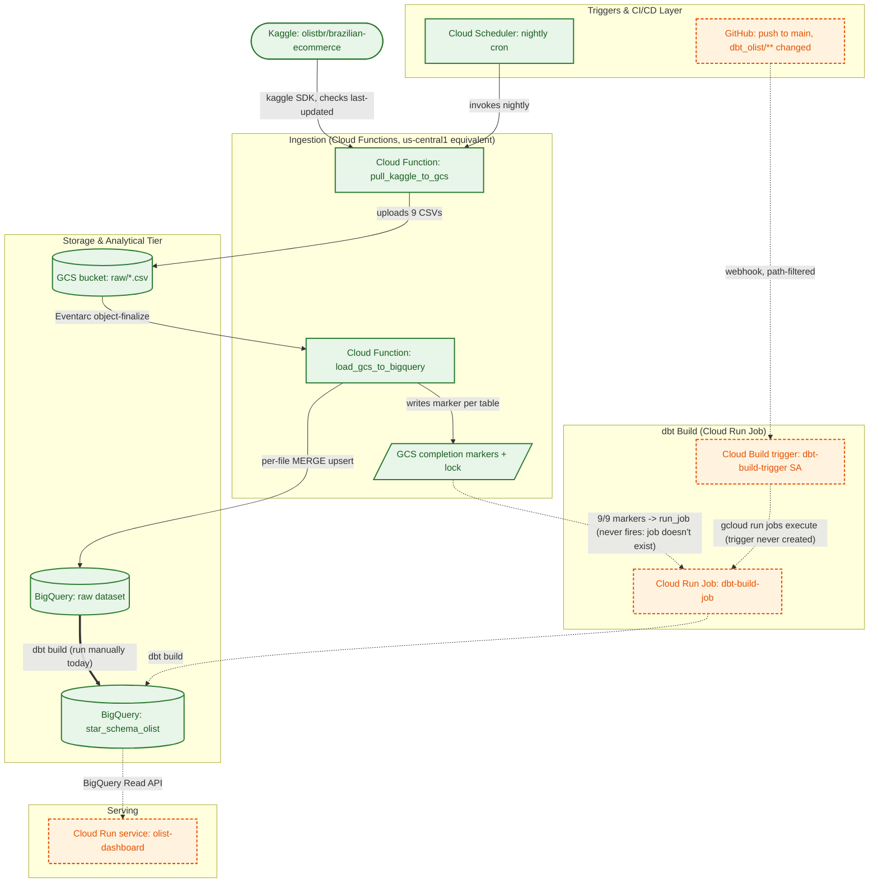

# Automated pipeline: ingestion, IAM, and dbt automation

Design rationale for the Kaggle -> GCS -> BigQuery ingestion pipeline, the
full IAM reference for every identity it needs, and the two dbt-build
automation paths (code-triggered and data-triggered). For the actual
commands to run all of this, see the main
[README.md How to run](../README.md#how-to-run) -- this doc is the "why,"
that one is the "what to type."

## Architecture

Laid out the same way as `mod2_dbt_project/docs/GCP_project_configuration.md`'s
own Mermaid diagram (trigger layer / compute layer / data layer subgraphs),
so the two are easy to compare side by side. Unlike that diagram, every node
and edge here is colored by verified deployment state, not just listed --
**green solid** lines are confirmed live (`gcloud ... list` actually returns
them), **orange dashed** lines are code that exists in this repo but was
never provisioned in GCP, per the Status table in the main README.



Two independent paths were built to reach `dbt-build-job`: one reacting to
new *data* (event-driven, via `MARKERS`), one reacting to new *code*
(GitHub-merge-driven, via `CB`). Both are fully coded -- `cloud_functions/`
for the data path, `cloudbuild.yaml` + the `dbt-build-trigger` service
account for the code path -- but neither is actually provisioned: `gcloud
run jobs list` and `gcloud builds triggers list` both come back empty, so
`JOB_DBT` itself doesn't exist yet, both dashed edges into it are dead ends,
and `dbt build` is 100% manual today (the solid green `BQ_RAW ==> BQ_MARTS`
edge). The dashboard is coded and has been deployed and verified once, but
is deliberately deleted between uses to avoid an unauthenticated public
BigQuery-cost surface -- hence orange, not green, despite working code.
See the main README's Status table for the line-by-line source of truth
this diagram is generated from.

### Why a MERGE upsert instead of `WRITE_TRUNCATE`?

Kaggle re-publishes this dataset as a full snapshot, not a delta, so a
naive reload has to choose between wiping the table every run
(`WRITE_TRUNCATE` -- cheap, but a mid-load failure leaves `raw` empty
until the next successful run, and any downstream query mid-load sees a
partial table) or upserting by key (costs one `MERGE` per file, but `raw`
is never briefly empty and a row Kaggle re-publishes with a corrected
value gets updated in place instead of silently duplicated).
`load_gcs_to_bigquery` loads each file into a throwaway per-table staging
table, then `MERGE`s it into `raw.<table>` on that table's natural key --
`order_id`, `product_id`, `(order_id, order_item_id)`, etc. `geolocation_raw`
has no natural key (~26% legitimate full-row duplicates by design, same as
the parked Postgres schema), so it matches on the full row and inserts only
what isn't already there.

### Why two Cloud Functions instead of one combined pull-and-load function?

Splitting the Kaggle pull from the BigQuery load lets the load step trigger
directly off each file landing in GCS (a Cloud Storage finalize event) rather
than on a second, independently-scheduled cron -- one less clock to keep in
sync, and a file that lands outside the normal schedule (a manual re-upload,
a retry) still gets picked up automatically.

### Why `kaggle.api.dataset_list()` + `dataset_download_files()` instead of `kagglehub`?

Two earlier attempts here crashed in production before settling on this:
`kaggle.api.dataset_view()` doesn't exist on the installed `kaggle`
package's `KaggleApi` class, and a follow-up guess
(`dataset_list(search=..., user="olistbr")`) returned zero results because
the added `user` filter over-constrains Kaggle's search. The working
implementation is modeled directly on
`mod2_dbt_project/cloud_funtions/mod2_dataset_robot/main.py`'s proven
pattern instead of guessing again: `dataset_list(search="brazilian-ecommerce")`
with no `user` filter, matched explicitly by `ref`; and downloading via
`kaggle.api.dataset_download_files(..., path="/tmp/...", unzip=True)`
rather than `kagglehub`, whose default cache location isn't guaranteed
writable in a Cloud Functions container -- only `/tmp` reliably is.
One more drift surfaced even after matching the reference: the reference
reads `dataset.lastUpdated` (camelCase), but the `kaggle` package version
that actually installs here (`kaggle==1.*`, unpinned to an exact version)
renamed that attribute to `last_updated` (snake_case) -- confirmed
directly by Python's own "did you mean" suggestion in the traceback, not
guessed. `_kaggle_last_updated()` tries both names so a future package
upgrade in either direction doesn't silently break this again.

### Why does `load_gcs_to_bigquery` create the raw table before merging into it?

`MERGE` requires its target table to already exist -- BigQuery won't
create one on the fly the way a plain load job will. That gap stayed
invisible through all of testing because `raw.*` already existed (first
from the old Postgres federation), until the whole `raw` dataset got
deleted and every `MERGE` started failing with `NotFound: Table raw.<table>
was not found`. `bq.create_table(..., exists_ok=True)` now runs before
every merge -- idempotent, a no-op once the table exists, but closes the
cold-start gap for a genuinely empty `raw` dataset.

### Two per-table load quirks, caught by an actual `dbt build` run, not guessed

`order_reviews` failed with `CSV table references column position 6, but
line contains only N columns` -- `review_comment_message` is free-text
review content that routinely contains literal newlines inside quoted CSV
fields, which BigQuery's parser splits into bogus rows without
`allow_quoted_newlines=True` (now set on every load, harmless for tables
without this issue). Separately, `geolocation_raw` failed with
invalid-value errors on `geolocation_lat` -- BigQuery's `NUMERIC` defaults
to a 9-digit decimal scale, unlike Postgres's arbitrary-precision
`NUMERIC`, and real values here have up to ~14 decimal digits. Fixed by
typing lat/lng as `FLOAT64` instead, which also matches how the star
schema already types `customer_lat`/`seller_lat`.

### Why does `pull_kaggle_to_gcs` re-pull unconditionally, or check first?

`_kaggle_last_updated()` checks Kaggle's dataset metadata and skips the
pull if unchanged, using a GCS marker file (`_meta/last_updated.txt`).

### Why the dbt trigger uses completion markers and a lock, not a direct call

`load_gcs_to_bigquery` runs once *per file* -- 9 separate, near-simultaneous
invocations per nightly pull, not one event for "tonight's batch is done."
Triggering `dbt build` on every single merge would run it up to 9x a
night, and some of those runs would hit `raw` only partially refreshed
(whichever tables happened to merge first) -- since the marts are full
rebuilds, not incremental, that bakes a transiently *wrong* snapshot into
`star_schema_olist.*`, not just a stale one, until a later run overwrites
it. So instead: every successful merge writes a small completion marker to
`gs://<bucket>/_meta/merged/<table>.done`, and only the invocation that
observes *all 9* markers present triggers the job -- then clears the
markers so tomorrow's batch starts clean. A GCS conditional write
(`if_generation_match=0`) makes "am I the one who gets to trigger it"
atomic, so a batch that completes in a tight burst still fires the job
exactly once, not once per invocation that happens to see a complete set.
A table that fails to merge simply never gets a marker -- the batch stays
incomplete and `dbt build` never fires on partial data, though a
permanently-stuck failure would need the `_meta/merged/` prefix cleared by
hand to unstick future batches. Full reasoning is also in
`cloud_functions/load_gcs_to_bigquery/main.py`'s own docstring.

**Scope of the code-change path:** the Cloud Build trigger fires when dbt
*code* changes merge to `main` -- it does not run on a schedule, and a
night where only fresh Kaggle data lands with no code change relies on the
data-triggered path above, not this one. Modeled on
`mod2_dbt_project/cloudbuild.yaml`'s build-image -> push -> update Cloud
Run Job -> execute mechanism, scoped to just `dbt_olist/` rather than that
project's shared dbt+notebook+streamlit image and `_PIPELINE_MODE`
branching -- see `dbt_olist/Dockerfile` and `cloudbuild.yaml` (repo root).
`--included-files="dbt_olist/**"` on the trigger is what satisfies
"detect changes that could affect the dbt build process" -- a merge
touching `cloud_functions/`, `dashboard/`, or `README.md` alone won't fire
it; anything under `dbt_olist/` (a model, a macro, `dbt_project.yml`,
`packages.yml`, even the `Dockerfile`) will.

## IAM reference: every service account and why

Every role below was actually required to get this pipeline running end-to-end
on `project-858e450f-408c-4bd2-941` -- most were only discovered when a
specific step failed partway through deployment (see the "discovered by"
column), not planned upfront. This section exists so a genuinely from-scratch
setup on a new account/project hits none of those errors, by granting
everything in the right order the first time. `<PROJECT_NUMBER>` below is
`588691405952` for this project; substitute your own (`gcloud projects
describe <PROJECT_ID> --format="value(projectNumber)"`) on a different one.

Six identities are involved. Two of them you never create yourself --
they're Google-managed and provisioned lazily on first use, which is itself
a common trap (see below).

### 1. Your own user account

If you create a brand-new GCP project yourself, you're automatically
`roles/owner` on it -- that one role covers every command in this guide, and
is the simplest path for a genuinely new account. If you're working inside a
project you don't own outright (shared, org-managed), the granular bundle
this guide's commands actually need instead:

| Role | Why |
|---|---|
| `roles/serviceusage.serviceUsageAdmin` | Enable the 8 APIs in step 1 |
| `roles/resourcemanager.projectIamAdmin` | Grant project-level roles to service accounts |
| `roles/iam.serviceAccountAdmin` | Create the `scheduler-invoker` service account |
| `roles/storage.admin` | Create the bucket, set its IAM |
| `roles/bigquery.admin` | Create datasets/tables |
| `roles/secretmanager.admin` | Create the Kaggle credential secrets |
| `roles/cloudfunctions.developer` + `roles/run.developer` | Deploy Cloud Functions Gen2 (Cloud Run underneath) and the dashboard |
| `roles/cloudscheduler.admin` | Create the nightly pull schedule |
| `roles/eventarc.admin` | Cloud Functions deploy creates the Eventarc trigger on your behalf, but needs this to succeed |

### 2. Default compute service account

`<PROJECT_NUMBER>-compute@developer.gserviceaccount.com` -- auto-created by
Google the first time the Compute Engine API is enabled on a project
(effectively every project has one; you never run `iam service-accounts
create` for it). **All four** of this pipeline's compute resources --
`pull-kaggle-to-gcs`, `load-gcs-to-bigquery`, the Eventarc trigger that
invokes it, and the dashboard's Cloud Run service -- default to running as
this one identity, because none of this guide's deploy commands pass
`--service-account` / `--trigger-service-account` to override it (see
"Worth reviewing" at the end of this section).

| Role | Scope | Why | Discovered by |
|---|---|---|---|
| `roles/secretmanager.secretAccessor` | secret `kaggle-username` | `pull-kaggle-to-gcs` reads it as `KAGGLE_USERNAME` | Designed in |
| `roles/secretmanager.secretAccessor` | secret `kaggle-key` | reads it as `KAGGLE_KEY` | Designed in |
| `roles/bigquery.dataEditor` | project | `load-gcs-to-bigquery` creates + writes `raw`/`raw_stage` tables; dashboard reads `star_schema_olist` | Designed in |
| `roles/bigquery.jobUser` | project | required to *run* any BigQuery job (load, query, `MERGE`) as this identity -- a separate permission from `dataEditor` | Designed in |
| `roles/storage.objectAdmin` | bucket `<bucket-name>` | `pull-kaggle-to-gcs` writes CSVs; `load-gcs-to-bigquery` reads them | Designed in |
| `roles/cloudbuild.builds.builder` | project | Cloud Functions Gen2 builds a container via Cloud Build under the hood; first deploy failed with "missing permission on the build service account" without this | First `pull-kaggle-to-gcs` deploy |
| `roles/eventarc.eventReceiver` | project | lets this SA, as the Eventarc trigger's identity, receive the GCS finalize event | `403 eventarc.events.receiveEvent` on the first fired trigger |
| `roles/run.invoker` | Cloud Run service `load-gcs-to-bigquery` | lets this SA actually *call* the function after receiving the event -- distinct from `eventReceiver`, both are required | "IAM principal lacks {run.routes.invoke}" warning in logs, persisting even after `eventReceiver` was granted |
| `roles/run.developer` | Cloud Run Job `dbt-build-job` | lets `load-gcs-to-bigquery` call `jobs.run()` on `dbt-build-job` once all 9 raw tables have merged -- see the data-triggered dbt automation above | Designed in for the event-driven dbt trigger |

Both of the last two grants are scoped to one specific Cloud Run resource,
so they can only be made *after* that resource is deployed/created once (it
has to exist to scope a binding to it) -- see the note on ordering below.

### 3. `scheduler-invoker` (dedicated service account you create)

Created explicitly (`gcloud iam service-accounts create scheduler-invoker`)
rather than reusing the default compute SA, so Cloud Scheduler's ability to
invoke a function is scoped to exactly the one function it needs
(`pull-kaggle-to-gcs`), not everything the default compute SA can touch.

| Role | Scope | Why |
|---|---|---|
| `roles/run.invoker` | Cloud Run service `pull-kaggle-to-gcs` | Granted via `gcloud functions add-invoker-policy-binding`, the function-aware wrapper (not a raw `add-iam-policy-binding`) -- lets Cloud Scheduler's OIDC-authenticated call actually invoke the function |

### 4. GCS's own Pub/Sub service agent (Google-managed)

`service-<PROJECT_NUMBER>@gs-project-accounts.iam.gserviceaccount.com`. Never
created with `iam service-accounts create` -- Google provisions it lazily
the first time a project actually uses a GCS -> Pub/Sub notification, which
for this pipeline means the Eventarc storage trigger's setup. **Granting a
role before it exists fails outright** ("Service account ... does not
exist"), which is exactly what happened on the first attempt here.

```powershell
# Force-provision it before granting anything:
gcloud storage service-agent --project=<PROJECT_ID>
```

| Role | Scope | Why |
|---|---|---|
| `roles/pubsub.publisher` | project | Lets GCS publish object-finalize events into Pub/Sub, which Eventarc's storage trigger consumes |

### 5. Eventarc's own service agent (Google-managed)

`service-<PROJECT_NUMBER>@gcp-sa-eventarc.iam.gserviceaccount.com`. Same
lazy-provisioning trap as #4 -- discovered via "Permission denied while
using the Eventarc Service Agent" on the first `load-gcs-to-bigquery`
deploy. One command both provisions it and grants its role:

```powershell
gcloud beta services identity create --service=eventarc.googleapis.com --project=<PROJECT_ID>
```

This grants the built-in `roles/eventarc.serviceAgent` role automatically --
no separate `add-iam-policy-binding` needed.

### 6. `dbt-build-trigger` (dedicated service account you create)

The GitHub-merge Cloud Build trigger runs as this identity, explicitly
assigned via `--service-account` at trigger-creation time -- **not** Cloud
Build's default `<PROJECT_NUMBER>@cloudbuild.gserviceaccount.com`. Two
reasons, one of them not optional:

- Google stopped auto-granting the default Cloud Build service account
  broad project permissions on projects created after mid-2024. This
  project was created during this build, so it almost certainly falls
  under that newer, more restrictive default -- meaning the default SA
  likely *can't* push images or manage Cloud Run Jobs here without a pile
  of the same manual grants a dedicated SA needs anyway, and Google's own
  guidance is to stop relying on it rather than patch it back to broad.
- It matches `mod2_dbt_project`'s own pattern -- every one of *their* five
  Cloud Build triggers runs as a dedicated `dbt-runner@...` identity, never
  the Cloud Build default SA.

A **custom** trigger service account needs every permission spelled out --
unlike the default SA, it inherits nothing implicitly, including logging:

```powershell
gcloud iam service-accounts create dbt-build-trigger --project=project-858e450f-408c-4bd2-941 --display-name="Cloud Build trigger for dbt-build-job"
```

| Role | Scope | Why |
|---|---|---|
| `roles/logging.logWriter` | project | Required for *any* user-specified Cloud Build trigger SA to write build logs -- the default SA has this bundled, a custom one does not |
| `roles/artifactregistry.writer` | project | Push the built image -- `gcr.io` pushes are Artifact-Registry-backed now; a custom SA doesn't inherit this the way the default SA historically did |
| `roles/run.developer` | project | Run `gcloud run jobs update` / `execute` against `dbt-build-job` |
| `roles/iam.serviceAccountUser` | the default compute SA (#2) | Required whenever one identity configures a resource (the job) to run as another identity -- here, the job runs as the compute SA from #2, which already holds `bigquery.dataEditor`/`jobUser` |

None of this has been exercised by a real trigger fire yet (the GitHub
connection step is manual -- see the main README's "How to run" step 10),
so treat it as documented-but-unverified: if the first real merge-triggered
build fails on a permission error, diagnose it the same way every other gap
in this guide was found, by reading the actual error.

### Correct order for a from-scratch setup

The two lazy-provisioning traps (#4, #5) and the deploy-before-you-can-scope
grants (the `run.invoker` and `run.developer` bindings in #2) are exactly
the ordering pitfalls this pipeline's actual deployment hit. Doing all of
this in the sequence below avoids every error this guide's "discovered by"
column names:

1. Enable APIs (How to run, step 1)
2. Force-provision the two Google-managed service agents (#4, #5 above) and
   grant their roles
3. Grant the default compute SA every role in #2 *except* the final two
   (`run.invoker`, `run.developer`) -- neither has anything to scope to yet
4. Create the bucket + `raw_stage` dataset, store Kaggle secrets
5. Deploy `pull-kaggle-to-gcs`; create `scheduler-invoker` and grant it (#3);
   create the Scheduler job
6. Deploy `load-gcs-to-bigquery` (its dbt-trigger code path stays dormant
   until `dbt-build-job` exists -- see step 9)
7. **Now** grant the default compute SA's `run.invoker` binding scoped to
   `load-gcs-to-bigquery` (row 8 of #2) -- the service exists now
8. `dbt build` manually once; deploy the dashboard
9. Create `dbt-build-trigger` and grant it the roles in #6, bootstrap the
   `dbt-build-job` image and Cloud Run Job, then connect GitHub and create
   the trigger (assigned to run as `dbt-build-trigger`)
10. **Now** grant the default compute SA's `run.developer` binding scoped to
    `dbt-build-job` (row 9 of #2) -- the job exists now, so
    `load-gcs-to-bigquery`'s event-driven trigger goes live from the next
    file merge onward

The main README's "How to run" follows this order.

### Worth reviewing (not changed here -- flagging for you to decide)

Two things would tighten this setup's IAM posture further. Neither is
implemented -- both are real trade-offs against the simplicity of what's
here, worth your explicit call rather than a silent change:

- **One shared identity for everything.** All four compute resources (both
  functions, the Eventarc trigger, the dashboard) run as the same default
  compute SA. A dedicated SA per resource would mean, e.g., a compromised
  dashboard couldn't also write to the ingestion bucket -- at the cost of
  repeating steps 2-3 above once per SA instead of once total.
- **Project-level `bigquery.dataEditor`/`jobUser`.** Both are granted at the
  project level, so this identity can edit *any* dataset, not just
  `raw`/`raw_stage`/`star_schema_olist`. BigQuery supports dataset-scoped
  IAM bindings (`bq add-iam-policy-binding` or a dataset's own ACL) that
  would narrow this to exactly the three datasets this pipeline touches.

## Parked: Postgres staging

The original design staged CSVs in a constraint-enforcing Postgres (Cloud
SQL) schema before federating into BigQuery. It's parked in favor of the
Kaggle -> GCS -> BigQuery pipeline above -- for a static Kaggle snapshot
dataset, the always-on Cloud SQL instance was more infrastructure than the
batch-loaded, non-real-time source needed, and the constraint-first
validation it gave has a dbt-test-based equivalent at the BigQuery layer
already (see [dbt_testing_and_staging.md](dbt_testing_and_staging.md)).
Nothing has been deleted: the schema, scripts, and reasoning below still
describe a working, tested path, kept for reference (or in case a future
revision needs synchronous constraint rejection again).

### Prerequisites (parked path)

- Python with `pandas`, `sqlalchemy`, `cloud-sql-python-connector[pg8000]`,
  `python-dotenv` installed
- A Cloud SQL for PostgreSQL instance already created

### 1. Configure credentials

```
cp .env.example .env
```
Fill in `INSTANCE_CONNECTION_NAME`, `DB_USER`, `DB_PASS`, `DB_NAME`.

### 2. Load raw CSVs into Postgres (Cloud SQL)

```
cd src
python apply_schema.py       # creates the staging schema + all 9 tables/constraints
python load_to_cloudsql.py   # loads all 9 CSVs, FK-safe order
```

### 3. Federate Cloud SQL into BigQuery

One-time setup (see full command reference in project history / ask if you
need the exact `bq mk --connection` / IAM-grant commands re-shared):

```
gcloud services enable bigqueryconnection.googleapis.com
bq mk --connection --connection_type=CLOUD_SQL ...
bq mk --dataset --location=<region> <project>:raw
```

Then, on every refresh:

```powershell
$conn = "<project>.<region>.<connection_name>"
$tables = @("customers","sellers","category_translation","products","geolocation_raw","orders","order_items","order_payments","order_reviews")
foreach ($t in $tables) {
    bq query --use_legacy_sql=false --location=<region> "CREATE OR REPLACE TABLE raw.$t AS SELECT * FROM EXTERNAL_QUERY('$conn', 'SELECT * FROM staging.$t')"
}
```

**Why Postgres for staging, not straight to BigQuery?** Chosen deliberately
via a CAP-theorem lens: this is a batch-loaded, non-real-time source, so
sacrificing Availability for Consistency + Partition tolerance was the right
trade -- a CP relational database lets constraint violations get caught at
write time (PK/FK/CHECK), rather than discovered after the fact.

**Why federated `EXTERNAL_QUERY` instead of a Python mover script or
GCS-staged load?** No intermediate copy step, no separate compute to run and
pay for -- BigQuery reads Cloud SQL directly through a secure, IAM-authenticated
connection. Traded off against a Python-script mover (more control, more
moving parts) and GCS-staged loading (heavier, more GCP-native for larger
scale); federation was the leanest fit for this data's size and cadence at
the time -- though note this path also recreates `raw.*` in full on every
refresh (`CREATE OR REPLACE TABLE ... AS SELECT`), which is what the new
pipeline's MERGE-based upsert improves on.
