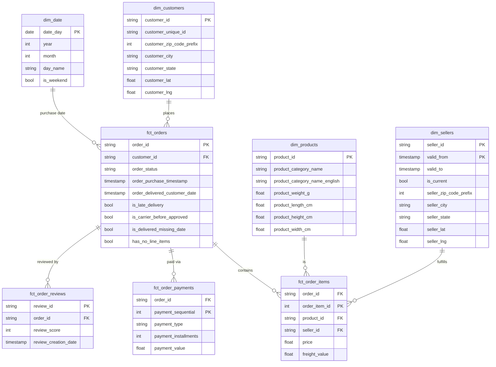

# dbt: staging, star schema, and test coverage

Design rationale for the transformation layer -- why the staging/marts
split looks the way it does, which dimension is Type 2 and why the others
aren't, and what the 54 dbt tests actually check. For the commands that
run this (`dbt build`, and how it gets triggered), see the main
[README.md](../README.md#how-to-run) and
[automated_pipeline.md](automated_pipeline.md).

## Why constraints are split between Postgres and dbt tests

Written when the Postgres staging path (see
[automated_pipeline.md's Parked: Postgres staging](automated_pipeline.md#parked-postgres-staging))
was still active -- the "Postgres enforces..." half below describes that
parked path, not the current pipeline. The dbt-side reasoning is
unaffected and still active either way: dbt tests are the only
enforcement layer now that ingestion goes straight from GCS into
BigQuery, so they carry the full load, not just "catch what Postgres
missed."

Postgres enforces structural rules with **zero known violations** at write
time (PK/FK uniqueness, `price > 0`, `review_score` 1-5, etc.) -- real
rejection, not just reporting. dbt tests re-assert the same rules at the
BigQuery layer (catches transfer/load bugs Postgres can't see) and additionally
carry the **anomaly monitors**: `is_late_delivery`, `is_carrier_before_approved`,
`is_delivered_missing_date`, `has_no_line_items` are computed once as columns
on `fct_orders`, then watched by `warn`-severity tests thresholded ~15-20%
above their known baseline rate -- normal operation stays green, only a
genuine spike surfaces a warning. These are never hard-enforced as CHECK
constraints because they're real, expected data, not corruption; rejecting
them would silently drop legitimate orders.

## Test coverage: what's checked, and what error vs warn actually means

Counted directly from `dbt_olist/models/staging/_staging__models.yml` and
`dbt_olist/models/marts/_marts__models.yml` -- **54 tests total**, all
generic/schema tests (no singular SQL test files; `dbt_olist/tests/`
doesn't exist).

| Test | What it checks |
|---|---|
| `unique` | No duplicate values in a column |
| `not_null` | Column is never null |
| `relationships` | Every value exists in the referenced table (foreign-key integrity) |
| `accepted_values` | Column only contains values from a fixed list |
| `dbt_utils.expression_is_true` | An arbitrary boolean SQL expression holds for every row |
| `dbt_utils.unique_combination_of_columns` | Composite-key uniqueness (e.g. `order_id` + `order_item_id`) |

**Error (default severity) -- 50 of 54 tests.** Everything except the four
anomaly monitors: every `unique`/`not_null`/`relationships`/`accepted_values`
test, staging and marts alike, plus hard numeric bounds in staging
(`price > 0`, `freight_value >= 0`, `payment_value >= 0`,
`payment_installments >= 0`, `review_score` in `[1,5]`). These are all
things verified to have **zero known violations** in the source data --
same philosophy as the Postgres `CHECK` constraints from the parked
pipeline. Any failure means something genuinely broke (a load bug, a
schema drift, real corruption), so it's treated as an error, no
exceptions.

**Warn -- 4 of 54 tests**, all on `fct_orders`, all the same shape:

| Flag | Baseline | Warns above |
|---|---|---|
| `is_late_delivery` | ~7,827 / 99,441 | 9,000 |
| `is_carrier_before_approved` | ~1,359 / 99,441 | 1,600 |
| `is_delivered_missing_date` | ~8 / 99,441 | 20 |
| `has_no_line_items` | ~775 / 99,441 | 900 |

Each is `dbt_utils.expression_is_true: "= false"` (i.e. "no row should
have this flag") combined with `severity: warn` + a `warn_if` threshold
set ~15-20% above the known baseline count. The two settings do different
jobs: `severity: warn` caps the *ceiling* -- this test can never become an
error, no matter how high the count climbs, since no `error_if` is set.
`warn_if` sets the *floor* -- below that count, the test passes silently
(green); only a genuine spike above the buffered baseline actually
surfaces as a warning. That's deliberate: these rows are real, expected
data (late deliveries genuinely happen), not corruption -- the test is
watching the *rate*, not asserting the flag never fires.

**Explicitly not tested, on purpose:** `product_category_name ->
category_translation` has no `relationships` test -- 2 known orphan
category values exist in the source data; enforcing it would just report
a permanent known failure. Delivery-timestamp anomalies
(carrier-before-approved, late deliveries) also aren't tested as
pass/fail conditions in staging -- they're real anomalies, modeled as the
flag columns above instead of duplicated as separate failing tests.

### What actually happens, operationally

**On error:** the node fails, `dbt build`/`dbt test` exits non-zero, and
-- the part that matters most -- **every downstream model that `ref()`s
the failed one gets skipped for that run**, not built with possibly-bad
data. In this project's automated paths (both the event-driven Cloud Run
Job trigger and the Cloud Build GitHub-merge trigger -- see
[automated_pipeline.md](automated_pipeline.md)), a non-zero `dbt` exit
means that `dbt-build-job` execution is recorded as failed (visible via
`gcloud run jobs executions list`/logs). Worth being direct about: there's
no Cloud Monitoring alert or Slack/email notification wired to that
failure -- a failed automated build is discoverable, not something that
proactively pages anyone, yet.

**On warn:** the test is logged as a warning, but the overall run still
exits **success** -- nothing downstream is skipped, `dbt build` completes
normally. The flagged rows aren't hidden either way: `is_late_delivery`
etc. are real columns on `fct_orders`, fully queryable (and exactly what
the dashboard's Delivery Performance page charts) whether the test passed
quietly or actively warned. The warning is purely a build-time nudge --
"the rate moved meaningfully off baseline, worth a human glance" -- not a
gate on the data itself. That's the literal implementation of the
project's stated design principle: **transparent flagging -- real
anomalies are surfaced as queryable data, never silently dropped or
hidden** (see the main README's Business case section).

## Why SCD Type 2 (`dbt snapshot`) only for sellers

A live pipeline (as opposed to this project's historical batch load) means
dimension attributes can genuinely change after facts referencing them
already exist. The decision to snapshot uses one test: **does a fact table
need the dimension's value as of the time the fact occurred, not just its
current value?**

Every dimension in the star schema was reviewed against that test:

| Dimension | Verdict | Reasoning |
|---|---|---|
| **`dim_sellers` (location)** | **Type 2 -- implemented** | Regional delivery/performance analysis needs a seller's location *at the time of each order*. If a seller relocates, historical shipping-performance numbers must not be silently rewritten to reflect their new location. This is the one case where the "genuine change + historical facts need point-in-time accuracy" test clearly holds. |
| `dim_customers` (address) | Reviewed, not implemented | Symmetric reasoning to sellers -- *but* Olist's `customer_id` is already one row per order (not per person; `customer_unique_id` is the repeat-customer key), so the source data already captures "address at time of order" structurally. Only becomes a real gap if a live system redesigns customers into one-row-per-person with in-place updates -- worth re-checking against the actual live source design before adding. |
| `dim_products` (category) | Reviewed, not implemented | Depends on *why* a category changes. A correction of bad data should propagate everywhere (Type 1); only a genuine reclassification needing point-in-time-accurate historical reporting would warrant Type 2. Left undecided pending that business clarification. |
| `dim_products` (weight/dimensions) | Reviewed, not implemented | Freight-cost analysis is tied to weight at time of shipment, so this looked like a candidate at first glance -- but a product's physical weight doesn't genuinely change; an updated value is almost always a data correction (originally mismeasured), which argues for Type 1, not Type 2. |
| `dim_customers` / `dim_sellers` (zip &rarr; lat/lng) | Reviewed, not implemented | Denormalized directly onto `dim_customers`/`dim_sellers` from `stg_geolocation` (rolled up to zip-prefix grain) rather than kept as a separate `dim_geolocation` table -- keeps the star schema a single join per dimension for the dashboard, at the cost of duplicating lat/lng across customers/sellers that share a zip prefix. Postal boundary reassignment happens in reality but is rare and low business value here, so no SCD Type 2 either -- for sellers, the coordinates still resolve correctly per historical period since the join key is each snapshot row's own `seller_zip_code_prefix`. |
| `category_translation` | Reviewed, not implemented | A translation fix is a correction, not a business event. |
| Order status lifecycle | Reviewed, not implemented (yet) | Currently captured via dedicated timestamp columns on `orders` (purchase/approved/carrier/delivered), which is a cleaner fit than SCD for this specific shape of history. Worth revisiting if a live system adds status types (canceled/returned/refunded) with no dedicated timestamp column and only mutates a generic `order_status` field -- at that point, snapshotting `order_status` becomes the practical fallback. |

So: one clear "yes" (sellers), several "reviewed and reasoned no" (not simply
skipped), and two genuinely conditional cases (customers, products) deferred
pending source-system design decisions rather than guessed at.

### `sellers_snapshot` implementation

- **Strategy**: `check` (compares `seller_zip_code_prefix`, `seller_city`,
  `seller_state`) -- there's no `updated_at` column in the source to use a
  `timestamp` strategy instead.
- **Sources from `raw.sellers` directly**, not `stg_sellers` -- dbt best
  practice, so snapshot history survives even if staging transformation logic
  changes later.
- `dim_sellers` is now genuinely Type 2: one row per `(seller_id, valid_from)`,
  exposing `valid_from` / `valid_to` / `is_current`. A fact-to-dimension join
  needing point-in-time accuracy should join on `seller_id` **and**
  `shipping_limit_date BETWEEN valid_from AND COALESCE(valid_to, '9999-12-31')`,
  not a plain equi-join on `seller_id` alone.
- History only starts accumulating from the point the snapshot first ran --
  the initial run just establishes a baseline (every seller gets one row).
  The payoff shows up once a seller's location actually changes in a
  subsequent run against a live, changing source.

## Star schema

`dim_sellers` is the one Type 2 dimension (composite key `seller_id` +
`valid_from`); every other dimension is Type 1. `fct_order_items`,
`fct_order_payments`, and `fct_order_reviews` are kept as separate fact
tables at their own natural grain rather than folded into `fct_orders`,
since an order can have multiple items, payments, and reviews -- joining
them into one row would fan out and inflate order-level metrics.

`customer_lat`/`customer_lng` and `seller_lat`/`seller_lng` are denormalized
onto `dim_customers`/`dim_sellers` from the raw geolocation dataset (rolled
up to zip-prefix grain, averaged where multiple points share a prefix)
rather than kept as a separate `dim_geolocation` table -- see the SCD design
notes above for why.
